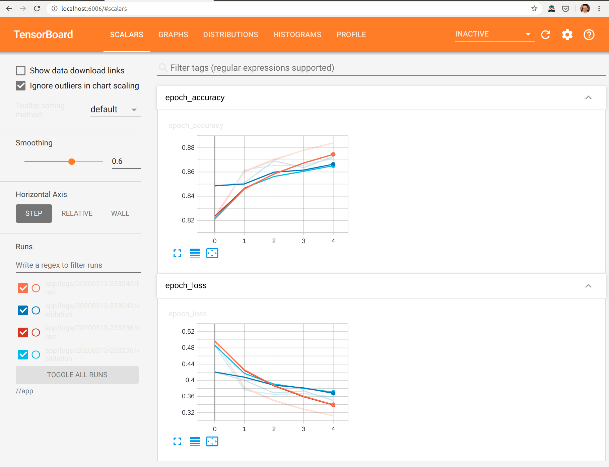
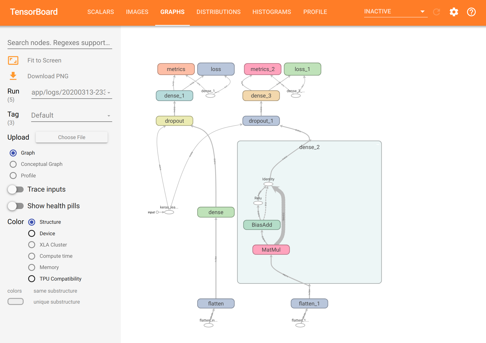
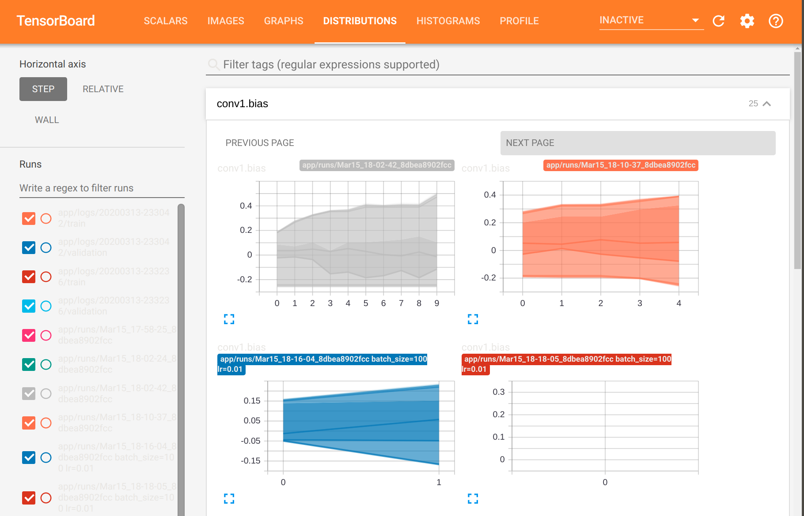
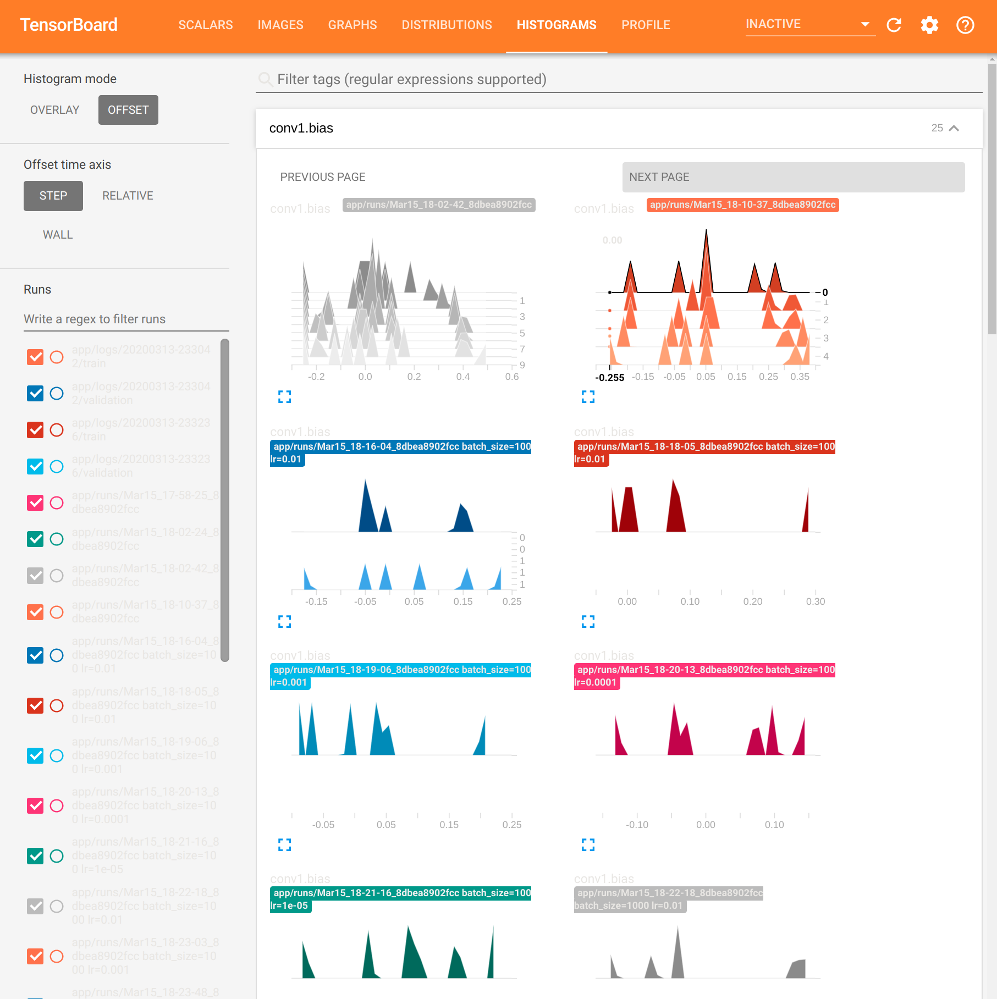

### NVIDIA GPU Tensorflow 2 + Tensorboard 
A complete computer vision container that includes Jupyter notebooks with built-in code hinting, Anaconda, CUDA-X, CuPy (GPU drop in replacement for Numpy), TF2, Tensorboard, for accelerated workloads on NVIDIA Tensor cores and GPUs.

There are working notebook examples on how to wire up, both Torch and TF2 to Tensorboard; Tensorflow Serving/TFX does model serving via REST API on port 8501, which can be configured for monitoring statistical concept drift as well.

-----------------------------------------------------------

It takes a while for OpenCV to compile for CUDA, so if you want to skip the build process to save time you can pull the pre-built image from DockerHub here:

https://hub.docker.com/r/jhoeller/computer-vision

``` docker pull jhoeller/computer-vision ```

-----------------------------------------------------------

### Features ###
- Anaconda: Accelerated Python, version 3.7.3
- CuPy: GPU accelerated drop in for Numpy
- Tensorflow 2 with Keras
- Tensorboard
- Repo includes working notebook example on how to wire up TF2 to TensorBoard, located in ```/app``` folder

### Built in code hinting in Jupyter Notebook ###

Press tab to see what methods you have access to by clicking tab.


--------------------------------------------------------------------------------
### Before you begin (This might be optional) ###

Link to nvidia-docker2 install: [Tutorial](https://medium.com/@sh.tsang/docker-tutorial-5-nvidia-docker-2-0-installation-in-ubuntu-18-04-cb80f17cac65)

You must install nvidia-docker2 and all it's deps first, assuming that is done, run:


 ` sudo apt-get install nvidia-docker2 `
 
 ` sudo pkill -SIGHUP dockerd `
 
 ` sudo systemctl daemon-reload `
 
 ` sudo systemctl restart docker `
 

How to run this container:


## If using Dockerfile (Recommended for Development - Will not deploy TFX/TensorFlow Serving):

### Step 1 ###

` docker build -t <container name> . `  < note the . after <container name>

If you get an authorized user from the docker pull cmd inside the container, try:

` $ docker logout `

...and then run it or pull again. As it is public repo you shouldn't need to login.

### Step 2 ###

Run the image, mount the volumes for Jupyter and app folder for your fav IDE, and finally the expose ports `8888` for Jupyter Notebook:


` docker run --rm -it --runtime=nvidia --user $(id -u):$(id -g) --group-add container_user --group-add sudo -v "${PWD}:/app" -p 8888:8888 -p 6006:6006 <container name> `


### Step 3: Check to make sure GPU drivers and CUDA is running ###

- <strong>Open another ssh tab</strong>, and exec into the container and check if your GPU is registering in the container and CUDA is working:

- Get the container id:

` docker ps `

- Exec into container:

` docker exec -u root -t -i <container id> /bin/bash `

- Check if NVIDIA GPU DRIVERS have container access:

` nvidia-smi `

- Check if CUDA is working:

` nvcc -V `


### Initialize Tensorboard

- Exec into the container as stated above, and run the following:

`tensorboard --logdir=//app --bind_all `

- You will recieve output that looks somnething like this:

`TensorBoard 2.1.0 at http://af5d7fc520cb:6006/`

Just replace `af5d7fc520cb` with the word `localhost` and launch in the browser, then you will see:






--------------------------------------------------


### Known conflicts with nvidia-docker and Ubuntu ###

AppArmor on Ubuntu has sec issues, so remove docker from it on your local box, (it does not hurt security on your computer):

` sudo aa-remove-unknown `

--------------------------------------------------

